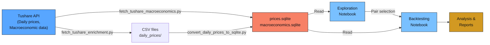
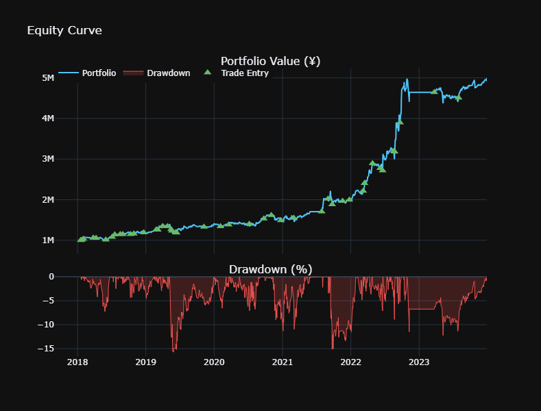

# Chinese A-Share Pair Trading Engine

A sophisticated statistical arbitrage framework for identifying and backtesting **mean-reverting stock pairs** in the Chinese A-share market, with full support for A-share market conventions, macroeconomic factor analysis, and position sizing strategies.

## Overview

**Pair trading** is a market-neutral strategy that exploits mean reversion in the spread between two correlated stocks. This project implements a complete pipeline:

1. **Data Pipeline**: Fetch and validate historical daily prices and macroeconomic data from Tushare
2. **Pair Discovery**: Screen correlations and residual diagnostics to identify candidates, using data only from the sample period to avoid look-ahead bias during backtesting
3. **Factor Analysis**: Model stock exposures to macro factors (Shibor, LPR, CPI, PPI, M1/M2, etc.) to test whether a stock pair hedge each other against macro movements, and whether different stock pairs within the portfolio are orthogonal to each other (to maximize portfolio sharpe ratio). Again, this needs to be done within sample period
4. **Backtesting**: Simulate realistic A-share trading with T+1 settlement, margin shorting, and transaction costs

## Core Concept

### The Pair Trading Strategy

Given two stocks $A$ and $B$, estimate a hedge ratio $\beta$ such that the **spread** is stationary:

$$S_t = P_{A,t} - \beta \cdot P_{B,t}$$

At any time $t$, we compute:

$$Z_t = \frac{S_t - \mu_S}{\sigma_S}$$

where $\mu_S$ and $\sigma_S$ are estimated from a rolling training window.

**Trading Rules:**
- **ENTRY**: When $|Z_t| > Z_{\text{entry}}$ (typically 2.0), take positions to bet on reversion
- **EXIT**: When $Z_t$ crosses $Z_{\text{exit}}$ (typically 0.5), close positions
- **STOP LOSS**: When $|Z_t| > Z_{\text{stop}}$ (typically 3.5), force close

### A-Share Market Conventions

The engine enforces realistic A-share rules:

| Feature | Behavior |
|---------|----------|
| **T+1 Settlement** | Long positions bought on day $T$ can only be sold from $T+1$ onward |
| **Margin Shorting** | Short positions can be closed immediately (no T+1 restriction) |
| **Price Limits** | If a stock is limit-up/down, the trade receives no fill |
| **Transaction Costs** | Commission 0.03% (both ways) + stamp duty 0.1% (sells only) |
| **Price Execution** | All trades execute at the day's **adjusted close** |

## Project Structure

```
.
├── README.md                              # This file
├── pair_trading_engine.py                 # Core backtesting engine
├── src/
│   ├── pair_trading_engine.py             # BacktestResult, PairTradingConfig, core logic
│   ├── regression.py                      # OLS/PCA factor loading calculations
│   └── __init__.py
├── data/
│   ├── prices.sqlite                      # Daily OHLCV + adjustment factors
│   ├── macroeconomics.sqlite              # Macro factors (Shibor, LPR, CPI, etc.)
│   └── daily_prices/                      # (Original CSV files, optional)
├── notebooks/
│   ├── pair_trading_exploration.ipynb     # EDA, correlation screening, data quality
│   ├── pair_trading_backtest.ipynb        # Run backtest & analyze results
│   ├── barra_macro.ipynb                  # Macro factor model & exposure analysis
│   └── test.ipynb                         # Unit tests & edge cases
├── fetch_tushare_enrichment.py            # Download stock metadata (basic, namechange, etc.)
├── fetch_tushare_macroeconomics.py        # Download macroeconomic time series
└── convert_daily_prices_to_sqlite.py      # Convert daily_prices/ CSVs → SQLite
```

## Data Pipeline



## Key Modules

### `src/pair_trading_engine.py`

**The core backtesting engine.** Implements:

- **`PairTradingConfig`**: Configuration dataclass specifying stock pair, date ranges, entry/exit thresholds, position sizing, and transaction costs
- **`BacktestResult`**: Container for equity curves, trade logs, spread diagnostics, and performance statistics
- **`_load_adjusted_close()`**: Fetch daily prices with proper adjustment factors from SQLite
- **`run_backtest()`**: Main entry point for running a single backtest

Key features:
- Realistic A-share T+1 settlement enforcement
- Price-limit detection (no fill on locked days)
- Multiple position sizing strategies: `fixed_notional`, `dollar_neutral`, `vol_scaled`
- Hedge ratio drift detection and alerts

### `src/regression.py`

**Macro factor analysis module.** Provides:

- **`ols_exposures(returns, factors)`**: Full-sample OLS regression to compute factor loadings $\beta$
- **`ols_rolling_exposures(returns, factors, window, n_components)`**: Rolling OLS with PCA dimensionality reduction
- **`pca_exposures(returns, pc_scores, pca_model, ...)`**: PCA-based factor exposure decomposition

Useful for understanding how two stocks react to macro shocks and verifying they can hedge each other.

## Notebooks

### 1. `pair_trading_exploration.ipynb`

**Purpose**: Data quality assessment and pair discovery  
**Key sections:**
- Database integrity check and schema inspection
- Coverage analysis: date range, symbol availability, trading volume
- Return panel construction with outlier detection
- Correlation matrix: find highly correlated stock pairs
- Residual diagnostics: check for mean reversion in spread

**Outputs**: List of candidate pairs ranked by correlation and residual stationarity

### 2. `pair_trading_backtest.ipynb`

**Purpose**: Run full backtests and analyze performance  
**Key sections:**
- Configure backtest parameters (entry/exit Z-scores, position size, costs)
- Execute backtest on selected pair(s)
- Visualize equity curve, drawdowns, trade log
- Compute Sharpe ratio, max drawdown, win rate, etc.

**Placeholder for Backtesting Diagram:**

<!-- BACKTESTING DIAGRAM TO BE ADDED HERE -->
<!-- Will include:-->
<!-- - Trade entry/exit triggers based on Z-score -->
<!-- - Equity curve evolution -->
<!-- - Position tracking (long A + short B, or vice versa) -->
<!-- - Performance metrics visualization -->

### 3. `barra_macro.ipynb`

**Purpose**: Macro factor model and stock exposure analysis  
**Key sections:**
- Load monthly macroeconomic factors (7 factors: Shibor, LPR, CPI, PPI, M1, M2, SF)
- Stationarity transformations (log-differencing for rate series)
- OLS and PCA regression to estimate factor loadings
- Compare exposure profiles for two candidate stocks
- Heatmap: cosine similarity across a universe of stocks

**Use Case**: Verify that your pair can hedge macro shocks; find other stocks with similar macro exposures

### 4. `test.ipynb`

**Purpose**: Unit tests and edge-case validation  
**Examples:**
- T+1 settlement enforcement
- Price-limit day handling
- Transaction cost computation
- Extreme returns and data gaps

## Setup & Usage

### Prerequisites

- **Python 3.9+**
- **Dependencies**: `pandas`, `numpy`, `scipy`, `statsmodels`, `scikit-learn`, `tushare`

Install:
```bash
pip install pandas numpy scipy statsmodels scikit-learn tushare jupyter matplotlib seaborn
```

### Step 1: Fetch Data

```bash
# Download macroeconomic data (requires Tushare token)
export TUSHARE_TOKEN="your_tushare_pro_token"
python fetch_tushare_macroeconomics.py

# Download stock metadata and daily prices
python fetch_tushare_enrichment.py

# Convert CSVs to SQLite (if you have daily_prices/ CSV files)
python convert_daily_prices_to_sqlite.py
```

### Step 2: Explore Data

Open `pair_trading_exploration.ipynb` in Jupyter:
```bash
jupyter notebook pair_trading_exploration.ipynb
```

Run all cells to inspect coverage, build correlations, and identify candidate pairs.

### Step 3: Run Backtest

Open `pair_trading_backtest.ipynb`:
```bash
jupyter notebook pair_trading_backtest.ipynb
```

Select a pair from the exploration notebook, configure thresholds and position sizing, and run the backtest.

### Step 4: Analyze Macro Exposures

Open `barra_macro.ipynb` to visualize macro factor loadings and ensure your pair can hedge macro shocks:
```bash
jupyter notebook barra_macro.ipynb
```

## Configuration Example

```python
from src.pair_trading_engine import PairTradingConfig, MultiPairTradingConfig, run_backtest

base_pair_kwargs_pair = dict(
    entry_z=2.0,
    exit_z=0.5,
    stop_loss_z=3.5,
    direction="long_short",
    ols_window=400,
    rebalance_freq_days=30,
    sizing="vol_scaled",
    vol_window=20, 
    fixed_notional=50_000.0,
    commission_rate=0.0003,
    stamp_duty_rate=0.001,
    cash_buffer_pct=0.80,
)

start_date = "20160101"
end_date = "20240101"

pair_cfgs = [
    PairTradingConfig(
        ts_code_a="000729.SZ",
        ts_code_b="601099.SH",
        pair_name="pair_1",
        start_date=start_date,
        end_date=end_date,
        **base_pair_kwargs,
    ),
    PairTradingConfig(
        ts_code_a="000776.SZ",
        ts_code_b="601877.SH",
        pair_name="pair_2",
        start_date=start_date,
        end_date=end_date,
        **base_pair_kwargs,
    ),
]

multi_pair_cfg = MultiPairTradingConfig(
    pairs=pair_cfgs,
    start_date=start_date,
        end_date=end_date,
    capital=1_000_000.0,
    db_path=Path("data/prices.sqlite"),
)

result = run_backtest(multi_pair_cfg)
print(f"Sharpe Ratio: {result.stats['sharpe_ratio']:.2f}")
print(f"Max Drawdown: {result.stats['max_drawdown']:.2%}")
```

## Key Features

✅ **A-share realism**: T+1 settlement, price limits, margin shorting  
✅ **Multiple position sizing strategies**: Fixed notional, dollar-neutral, volatility-scaled  
✅ **Macro factor framework**: Understand how your pair responds to macro shocks  
✅ **Rolling hedge ratios**: Automatically update $\beta$ as market conditions change  
✅ **Comprehensive diagnostics**: Drift alerts, residual checks, correlation tracking  
✅ **Transaction costs**: Commission + stamp duty applied realistically  

## Final Strategy Backtesting Results & Diagrams

## Backtest Summary

| Metric | Value |
|---|---|
| Round-Trip Trades | 44 |
| Win Rate | 72.73% |
| Avg Round-Trip PnL | ¥82,649.73 |
| Total Transaction Costs | ¥91,121.62 |
| Starting Portfolio Value | ¥1,000,000.00 |
| Ending Portfolio Value | ¥5,002,378.23 |
| Rebalance Frequency | 30 days |
| Traded Pairs | pair_1, pair_2, pair_3, pair_4, pair_5 |

### Portfolio Value




## References & Further Reading

1. **Pairs Trading: Quantitative Methods and Analysis** — Ganapathy Vidyamurthy
2. **Statistical Arbitrage: Algorithmic Trading Insights and Techniques** — Andrew Pole
3. **Tushare API Documentation**: https://www.tushare.pro/
4. **A-Share Market Rules**: China Securities Regulatory Commission (CSRC) official guidelines

## License

This project is provided as-is for research and educational purposes. Use at your own risk.

---

**Last Updated**: June 2026  
**Contact & Contributions**: Contributions welcome. Please open an issue or PR for bugs, feature requests, or improvements.